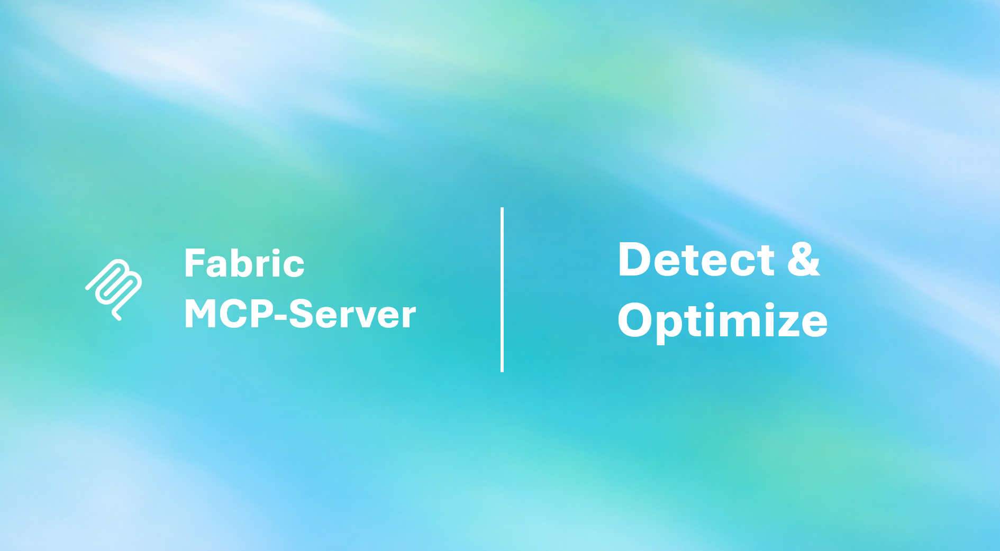

<p align="center">
  
</p>

<h1 align="center">Force Fabric MCP Server</h1>

<p align="center">
  <strong>Detect issues. Auto-fix problems. Optimize your Fabric tenant.</strong><br>
  An MCP server that scans Lakehouses, Warehouses, Eventhouses, and Semantic Models with 113 rules — and can auto-fix 47 of them.
</p>

<p align="center">
  <a href="#-quick-start">Quick Start</a> •
  <a href="#-detect--scan">Detect</a> •
  <a href="#-auto-fix">Auto-Fix</a> •
  <a href="#-rule-reference">Rules</a> •
  <a href="#-architecture">Architecture</a>
</p>

---

## ✨ Key Features

### 🔍 Detect — 113 Rules Across 4 Fabric Items

| Item | Rules | What's Scanned |
|------|-------|----------------|
| 🏠 **Lakehouse** | 29 | SQL Endpoint + OneLake Delta Log (VACUUM history, file sizes, partitioning, retention) |
| 🏗️ **Warehouse** | 39 | Schema, query performance, security (PII, RLS), database config |
| 📊 **Eventhouse** | 13/db | Extent fragmentation, caching/retention policies, ingestion failures, query performance |
| 📐 **Semantic Model** | 32 | DAX expression anti-patterns, model structure, COLUMNSTATISTICS BPA |
| | **113 total** | |

### 🔧 Fix — 47 Auto-Fixable Issues

| Item | Auto-Fixes | Method |
|------|-----------|--------|
| 🏗️ **Warehouse** | 12 fixes | SQL DDL executed directly |
| 🏠 **Lakehouse** | 14 fixes | REST API (3) + Notebook Spark SQL (11) |
| 📐 **Semantic Model** | 12 fixes | model.bim REST API (6) + Notebook sempy (6) |
| 📊 **Eventhouse** | 3 fixes | KQL management commands |
| | **41 total** | |

### 📊 Unified Output

Every scan returns a clean results table — only issues shown, passed rules counted in summary:

```
29 rules — ✅ 18 passed | 🔴 1 failed | 🟡 10 warning

| Rule | Status | Finding | Recommendation |
|------|--------|---------|----------------|
| LH-007 Key Columns Are NOT NULL | 🔴 | 16 key column(s) allow NULL: table.finding_id, ... | Add NOT NULL constraints |
| LH-017 Regular VACUUM Executed | 🟡 | 4 table(s) need VACUUM: table1, table2, ... | Run VACUUM weekly |
```

---

## 🚀 Quick Start

### Prerequisites

- **Node.js** 18+
- **Azure CLI** with `az login` completed
- **Fabric capacity** with items to scan

### Install

```bash
git clone https://github.com/tmdaidevs/Force-Fabric-MCP-Server.git
cd Force-Fabric-MCP-Server
npm install
npm run build
```

### Configure VS Code

Add to `.vscode/mcp.json` in your project:

```json
{
  "servers": {
    "fabric-optimization": {
      "type": "stdio",
      "command": "node",
      "args": ["dist/index.js"],
      "cwd": "/path/to/Force-Fabric-MCP-Server"
    }
  }
}
```

### Use

```
1. "Login to Fabric with azure_cli"
2. "List all lakehouses in workspace <id>"
3. "Scan lakehouse <id> in workspace <id>"
4. "Fix warehouse <id> in workspace <id>"
```

---

## 🔍 Detect & Scan

### Available Scan Tools

| Tool | What It Does |
|------|-------------|
| `lakehouse_optimization_recommendations` | Scans SQL Endpoint + reads Delta Log files from OneLake |
| `warehouse_optimization_recommendations` | Connects via SQL and runs 39 diagnostic queries |
| `warehouse_analyze_query_patterns` | Focused analysis of slow/frequent/failed queries |
| `eventhouse_optimization_recommendations` | Runs KQL diagnostics on each KQL database |
| `semantic_model_optimization_recommendations` | Executes DAX + MDSCHEMA DMVs for BPA analysis |

### Data Sources Used

```
                          ┌─────────────────────────────────────┐
                          │         Fabric REST API             │
                          │  Workspaces, Items, Metadata        │
                          └──────────────┬──────────────────────┘
                                         │
          ┌──────────────┬───────────────┼───────────────┬──────────────┐
          ▼              ▼               ▼               ▼              ▼
   ┌─────────────┐ ┌──────────┐ ┌──────────────┐ ┌──────────┐ ┌──────────────┐
   │  SQL Client │ │ KQL REST │ │ OneLake ADLS │ │ DAX API  │ │ MDSCHEMA DMV │
   │  (tedious)  │ │   API    │ │  Gen2 API    │ │executeQry│ │  via REST    │
   └──────┬──────┘ └────┬─────┘ └──────┬───────┘ └────┬─────┘ └──────┬───────┘
          │              │              │              │              │
    Lakehouse SQL   Eventhouse    Delta Log JSON   Semantic     Semantic
    Warehouse SQL   KQL DBs       File Metadata    Model DAX    Model Meta
```

---

## 🔧 Auto-Fix

### Warehouse Fixes (`warehouse_fix`)

Run all safe fixes or specify individual rule IDs:

| Rule ID | What It Fixes | SQL Command |
|---------|--------------|-------------|
| WH-001 | Missing primary keys | `ALTER TABLE ADD CONSTRAINT PK NOT ENFORCED` |
| WH-008 | Stale statistics (>30 days) | `UPDATE STATISTICS [table]` |
| WH-009 | Disabled constraints | `ALTER TABLE WITH CHECK CHECK CONSTRAINT ALL` |
| WH-016 | Missing audit columns | `ALTER TABLE ADD created_at DATETIME2 DEFAULT GETDATE()` |
| WH-018 | Unmasked sensitive data | `ALTER COLUMN ADD MASKED WITH (FUNCTION='...')` |
| WH-026 | Auto-update statistics off | `ALTER DATABASE SET AUTO_UPDATE_STATISTICS ON` |
| WH-027 | Result set caching off | `ALTER DATABASE SET RESULT_SET_CACHING ON` |
| WH-028 | Snapshot isolation off | `ALTER DATABASE SET ALLOW_SNAPSHOT_ISOLATION ON` |
| WH-029 | Page verify not CHECKSUM | `ALTER DATABASE SET PAGE_VERIFY CHECKSUM` |
| WH-030 | ANSI settings off | `ALTER DATABASE SET ANSI_NULLS ON; ...` |
| WH-032 | Missing statistics | `UPDATE STATISTICS [table]` |
| WH-036 | NOT NULL without defaults | `ALTER TABLE ADD DEFAULT ... FOR column` |

### Eventhouse Fixes (`eventhouse_fix`)

| Rule ID | What It Fixes | KQL Command |
|---------|--------------|-------------|
| EH-002 | Fragmented extents | `.merge table ['name']` |
| EH-004 | Missing caching policy | `.alter table/database policy caching hot = 30d` |
| EH-005 | Missing retention policy | `.alter table/database policy retention softdelete = 365d` |

### Lakehouse Fixes (`lakehouse_run_table_maintenance`)

| Fix | Parameters |
|-----|-----------|
| OPTIMIZE with V-Order | `optimizeSettings: { vOrder: true }` |
| Z-Order by columns | `optimizeSettings: { zOrderColumns: ["col1", "col2"] }` |
| VACUUM stale files | `vacuumSettings: { retentionPeriod: "7.00:00:00" }` |

### Semantic Model Fixes (`semantic_model_fix`)

Downloads model.bim, applies modifications, uploads back:

| Fix ID | What It Fixes | Method |
|--------|--------------|--------|
| SM-FIX-FORMAT | Add format strings to measures without one | model.bim |
| SM-FIX-DESC | Add descriptions to visible tables | model.bim |
| SM-FIX-HIDDEN | Set IsAvailableInMDX=false on hidden columns | model.bim |
| SM-FIX-DATE | Mark date/calendar tables as Date table | model.bim |
| SM-FIX-KEY | Set IsKey=true on PK columns in relationships | model.bim |
| SM-FIX-AUTODATE | Remove auto-date tables | model.bim |

### 📓 Notebook-Based Fixes

For fixes that require Spark SQL, the MCP server creates a **temporary Notebook**, runs it, and deletes it:

```
1. POST /notebooks              → Create temp notebook with fix code
2. POST /items/{id}/jobs        → Execute notebook
3. GET  /items/{id}/jobs/{job}  → Poll until complete
4. DELETE /notebooks/{id}       → Clean up
```

#### Lakehouse Notebook Fixes

| Rule | Spark SQL Command |
|------|------------------|
| LH-003 | `CONVERT TO DELTA spark_catalog.lakehouse.table` |
| LH-005 | `DROP TABLE lakehouse.table` |
| LH-009 | `ALTER TABLE lakehouse.table RENAME COLUMN old TO new` |
| LH-014 | `ALTER TABLE t ADD COLUMN created_at TIMESTAMP DEFAULT current_timestamp()` |
| LH-020 | `ALTER TABLE t SET TBLPROPERTIES ('delta.autoOptimize.optimizeWrite'='true')` |
| LH-021 | `ALTER TABLE t SET TBLPROPERTIES ('delta.logRetentionDuration'='interval 30 days')` |
| LH-024 | `ALTER TABLE t SET TBLPROPERTIES ('delta.dataSkippingNumIndexedCols'='32')` |
| LH-S04 | `ALTER TABLE t ADD COLUMN id BIGINT` |

#### Semantic Model Notebook Fixes (via sempy_labs)

| Fix | sempy Code |
|-----|-----------|
| Remove Calculated Columns | `tom.remove_column(table, column)` |
| Remove Calculated Tables | `tom.remove_table(table)` |
| Fix Bi-directional Relationships | `rel.CrossFilteringBehavior = OneDirection` |
| Fix RLS Expressions | `table_permission.FilterExpression = ...` |
| Sync DirectLake Schema | `labs.update_direct_lake_model_lakehouse_schema()` |
| Refresh Model | `fabric.refresh_dataset(dataset, workspace)` |

---

## 📋 Rule Reference

### Summary

| Category | HIGH | MEDIUM | LOW | INFO | Total | Auto-Fix |
|----------|------|--------|-----|------|-------|----------|
| 🏠 Lakehouse | 5 | 14 | 9 | 1 | **29** | 14 (3 REST + 11 Notebook) |
| 🏗️ Warehouse | 8 | 17 | 12 | 0 | **39** | 12 (SQL DDL) |
| 📊 Eventhouse | 4 | 6 | 0 | 1 | **13** | 3 (KQL) |
| 📐 Semantic Model | 7 | 14 | 9 | 0 | **32** | 12 (6 model.bim + 6 Notebook) |
| **Total** | **24** | **51** | **30** | **2** | **113** | **41** |

<details>
<summary><strong>🏠 Lakehouse — 29 Rules</strong> (click to expand)</summary>

| # | Rule | Category | Severity | Auto-Fix |
|---|------|----------|----------|----------|
| LH-001 | SQL Endpoint Active | Availability | HIGH | — |
| LH-002 | Medallion Architecture Naming | Maintainability | LOW | — |
| LH-003 | All Tables Use Delta Format | Performance | HIGH | 📓 Notebook |
| LH-004 | Table Maintenance Recommended | Performance | MEDIUM | 🔧 REST API |
| LH-005 | No Empty Tables | Data Quality | MEDIUM | 📓 Notebook |
| LH-006 | No Over-Provisioned String Columns | Performance | MEDIUM | — |
| LH-007 | Key Columns Are NOT NULL | Data Quality | HIGH | — |
| LH-008 | No Float/Real Precision Issues | Data Quality | MEDIUM | — |
| LH-009 | Column Naming Convention | Maintainability | LOW | 📓 Notebook |
| LH-010 | Date Columns Use Proper Types | Data Quality | MEDIUM | — |
| LH-011 | Numeric Columns Use Proper Types | Data Quality | MEDIUM | — |
| LH-012 | No Excessively Wide Tables | Maintainability | LOW | — |
| LH-013 | Schema Has NOT NULL Constraints | Data Quality | MEDIUM | — |
| LH-014 | Tables Have Audit Columns | Maintainability | LOW | 📓 Notebook |
| LH-015 | Consistent Date Types Per Table | Data Quality | LOW | — |
| LH-S01 | No Unprotected Sensitive Data | Security | HIGH | — |
| LH-S02 | Large Tables Identified | Performance | INFO | — |
| LH-S03 | No Deprecated Data Types | Maintainability | HIGH | — |
| LH-S04 | All Tables Have Key Columns | Data Quality | MEDIUM | 📓 Notebook |
| LH-016 | Large Tables Are Partitioned | Performance | MEDIUM | — |
| LH-017 | Regular VACUUM Executed | Maintenance | MEDIUM | 🔧 REST API |
| LH-018 | Regular OPTIMIZE Executed | Performance | MEDIUM | 🔧 REST API |
| LH-019 | No Small File Problem | Performance | HIGH | 🔧 REST API |
| LH-020 | Auto-Optimize Enabled | Performance | MEDIUM | 📓 Notebook |
| LH-021 | Retention Policy Configured | Maintenance | LOW | 📓 Notebook |
| LH-022 | Delta Log Version Count Reasonable | Performance | LOW | 🔧 REST API |
| LH-023 | Low Write Amplification | Performance | MEDIUM | — |
| LH-024 | Data Skipping Configured | Performance | LOW | 📓 Notebook |
| LH-025 | Z-Order on Large Tables | Performance | MEDIUM | 🔧 REST API |

</details>

<details>
<summary><strong>🏗️ Warehouse — 39 Rules</strong> (click to expand)</summary>

| # | Rule | Category | Severity | Auto-Fix |
|---|------|----------|----------|----------|
| WH-001 | Primary Keys Defined | Data Quality | HIGH | 🔧 SQL |
| WH-002 | No Deprecated Data Types | Maintainability | HIGH | — |
| WH-003 | No Float/Real Precision Issues | Data Quality | MEDIUM | — |
| WH-004 | No Over-Provisioned Columns | Performance | MEDIUM | — |
| WH-005 | Column Naming Convention | Maintainability | LOW | — |
| WH-006 | Table Naming Convention | Maintainability | LOW | — |
| WH-007 | No SELECT * in Views | Maintainability | LOW | — |
| WH-008 | Statistics Are Fresh | Performance | MEDIUM | 🔧 SQL |
| WH-009 | No Disabled Constraints | Data Quality | MEDIUM | 🔧 SQL |
| WH-010 | Key Columns Are NOT NULL | Data Quality | HIGH | — |
| WH-011 | No Empty Tables | Maintainability | MEDIUM | — |
| WH-012 | No Excessively Wide Tables | Maintainability | MEDIUM | — |
| WH-013 | Consistent Date Types | Data Quality | LOW | — |
| WH-014 | Foreign Keys Defined | Maintainability | MEDIUM | — |
| WH-015 | No Large BLOB Columns | Performance | MEDIUM | — |
| WH-016 | Tables Have Audit Columns | Maintainability | LOW | 🔧 SQL |
| WH-017 | No Circular Foreign Keys | Data Quality | HIGH | — |
| WH-018 | Sensitive Data Protected | Security | HIGH | 🔧 SQL |
| WH-019 | Row-Level Security | Security | MEDIUM | — |
| WH-020 | Minimal db_owner Privileges | Security | MEDIUM | — |
| WH-021 | No Over-Complex Views | Maintainability | LOW | — |
| WH-022 | Minimal Cross-Schema Dependencies | Maintainability | LOW | — |
| WH-023 | No Very Slow Queries | Performance | HIGH | — |
| WH-024 | No Frequently Slow Queries | Performance | HIGH | — |
| WH-025 | No Recent Query Failures | Reliability | MEDIUM | — |
| WH-026 | AUTO_UPDATE_STATISTICS Enabled | Performance | HIGH | 🔧 SQL |
| WH-027 | Result Set Caching Enabled | Performance | MEDIUM | 🔧 SQL |
| WH-028 | Snapshot Isolation Enabled | Concurrency | MEDIUM | 🔧 SQL |
| WH-029 | Page Verify CHECKSUM | Reliability | MEDIUM | 🔧 SQL |
| WH-030 | ANSI Settings Correct | Standards | LOW | 🔧 SQL |
| WH-031 | Database ONLINE | Availability | HIGH | — |
| WH-032 | All Tables Have Statistics | Performance | MEDIUM | 🔧 SQL |
| WH-033 | Optimal Data Types | Performance | MEDIUM | — |
| WH-034 | No Near-Empty Tables | Maintainability | LOW | — |
| WH-035 | Stored Procedures Documented | Maintainability | LOW | — |
| WH-036 | NOT NULL Columns Have Defaults | Data Quality | MEDIUM | 🔧 SQL |
| WH-037 | Consistent String Types | Maintainability | LOW | — |
| WH-038 | Schemas Are Documented | Maintainability | LOW | — |
| WH-039 | Query Performance Healthy | Performance | MEDIUM | — |

</details>

<details>
<summary><strong>📊 Eventhouse — 13 Rules per KQL Database</strong> (click to expand)</summary>

| # | Rule | Category | Severity | Auto-Fix |
|---|------|----------|----------|----------|
| EH-001 | Query Endpoint Available | Availability | HIGH | — |
| EH-002 | No Extent Fragmentation | Performance | HIGH | 🔧 KQL |
| EH-003 | Good Compression Ratio | Performance | MEDIUM | — |
| EH-004 | Caching Policy Configured | Performance | MEDIUM | 🔧 KQL |
| EH-005 | Retention Policy Configured | Data Management | MEDIUM | 🔧 KQL |
| EH-006 | Materialized Views Healthy | Reliability | HIGH | — |
| EH-007 | Data Is Fresh | Data Quality | MEDIUM | — |
| EH-008 | No Slow Query Patterns | Performance | HIGH | — |
| EH-009 | No Recent Failed Commands | Reliability | MEDIUM | — |
| EH-010 | No Ingestion Failures | Reliability | HIGH | — |
| EH-011 | Streaming Ingestion Config | Performance | INFO | — |
| EH-012 | Continuous Exports Healthy | Reliability | MEDIUM | — |
| EH-013 | Hot Cache Coverage | Performance | MEDIUM | — |

</details>

<details>
<summary><strong>📐 Semantic Model — 32 Rules</strong> (click to expand)</summary>

| # | Rule | Category | Severity | Auto-Fix |
|---|------|----------|----------|----------|
| SM-001 | Avoid IFERROR Function | DAX | MEDIUM | 📓 Notebook |
| SM-002 | Use DIVIDE Function | DAX | MEDIUM | 📓 Notebook |
| SM-003 | No EVALUATEANDLOG in Production | DAX | HIGH | 📓 Notebook |
| SM-004 | Use TREATAS not INTERSECT | DAX | MEDIUM | — |
| SM-005 | No Duplicate Measure Definitions | DAX | LOW | — |
| SM-006 | Filter by Columns Not Tables | DAX | MEDIUM | 📓 Notebook |
| SM-007 | Avoid Adding 0 to Measures | DAX | LOW | — |
| SM-008 | Measures Have Documentation | Maintenance | LOW | 🔧 model.bim + 📓 |
| SM-009 | Model Has Tables | Maintenance | HIGH | — |
| SM-010 | Model Has Date Table | Performance | MEDIUM | 🔧 model.bim |
| SM-011 | Avoid 1-(x/y) Syntax | DAX | MEDIUM | — |
| SM-012 | No Direct Measure References | DAX | LOW | — |
| SM-013 | Avoid Nested CALCULATE | DAX | MEDIUM | — |
| SM-014 | Use SUM Instead of SUMX | DAX | LOW | — |
| SM-015 | Measures Have Format String | Formatting | LOW | 🔧 model.bim |
| SM-016 | Avoid FILTER(ALL(...)) | DAX | MEDIUM | — |
| SM-017 | Measure Naming Convention | Formatting | LOW | — |
| SM-018 | Reasonable Table Count | Performance | LOW | — |
| SM-B01 | No High Cardinality Text Columns | Data Types | HIGH | — |
| SM-B02 | No Description/Comment Columns | Data Types | HIGH | — |
| SM-B03 | No GUID/UUID Columns | Data Types | HIGH | — |
| SM-B04 | No Constant Columns | Data Types | MEDIUM | — |
| SM-B05 | No Booleans Stored as Text | Data Types | MEDIUM | — |
| SM-B06 | No Dates Stored as Text | Data Types | MEDIUM | — |
| SM-B07 | No Numbers Stored as Text | Data Types | MEDIUM | — |
| SM-B08 | Integer Keys Not String Keys | Data Types | MEDIUM | — |
| SM-B09 | No Excessively Wide Tables | Data Types | MEDIUM | — |
| SM-B10 | No Extremely Wide Tables | Data Types | HIGH | — |
| SM-B11 | No Multiple High-Cardinality Columns | Data Types | HIGH | — |
| SM-B12 | No Single Column Tables | Data Types | LOW | — |
| SM-B13 | No High-Precision Timestamps | Data Types | MEDIUM | — |
| SM-B14 | No Low Cardinality in Fact Tables | Data Types | LOW | — |

</details>

---

## 🏗️ Architecture

```
src/
├── index.ts                    MCP server entry point (stdio transport)
├── auth/
│   └── fabricAuth.ts           Azure auth (CLI, browser, device code, SP)
├── clients/
│   ├── fabricClient.ts         Fabric REST API + DAX + model.bim CRUD
│   ├── sqlClient.ts            SQL via tedious (Lakehouse + Warehouse)
│   ├── kqlClient.ts            KQL/Kusto REST API (Eventhouse)
│   ├── onelakeClient.ts        OneLake ADLS Gen2 + Delta Log parser
│   └── xmlaClient.ts           XMLA SOAP client (experimental)
└── tools/
    ├── ruleEngine.ts           Shared RuleResult type + unified renderer
    ├── auth.ts                 auth_login, auth_status, auth_logout
    ├── workspace.ts            workspace_list
    ├── lakehouse.ts            29 rules + table maintenance
    ├── warehouse.ts            39 rules + 12 auto-fixes
    ├── eventhouse.ts           13 rules + 3 auto-fixes
    └── semanticModel.ts        32 rules + 6 auto-fixes (model.bim)
```

## 🔐 Authentication

| Method | Use Case |
|--------|----------|
| `azure_cli` | **Recommended** — uses your `az login` session |
| `interactive_browser` | Opens browser for interactive login |
| `device_code` | Headless/remote environments |
| `vscode` | Uses VS Code Azure account |
| `service_principal` | CI/CD (requires tenantId, clientId, clientSecret) |
| `default` | Auto-detect best available method |

## 📄 License

MIT
